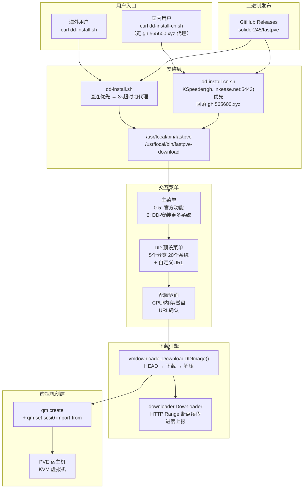
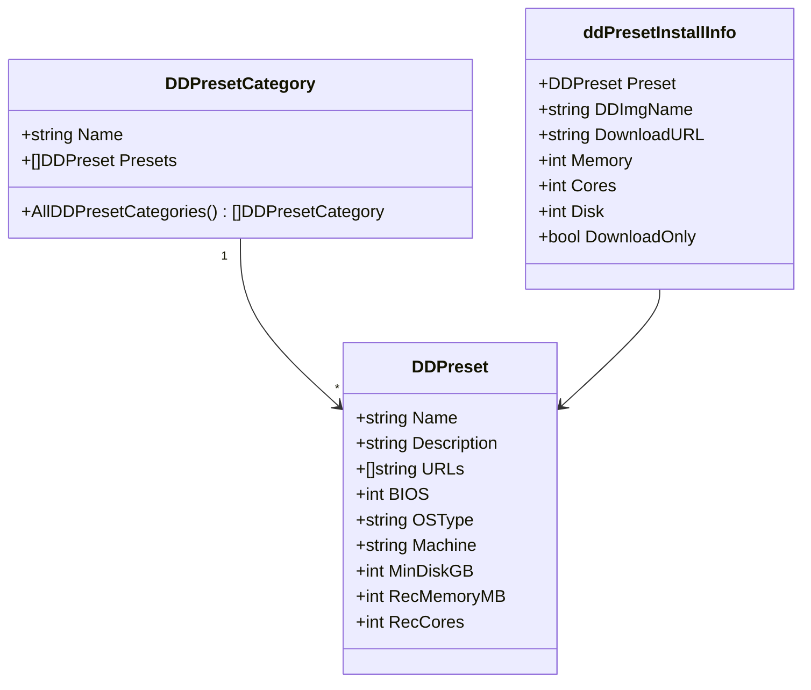
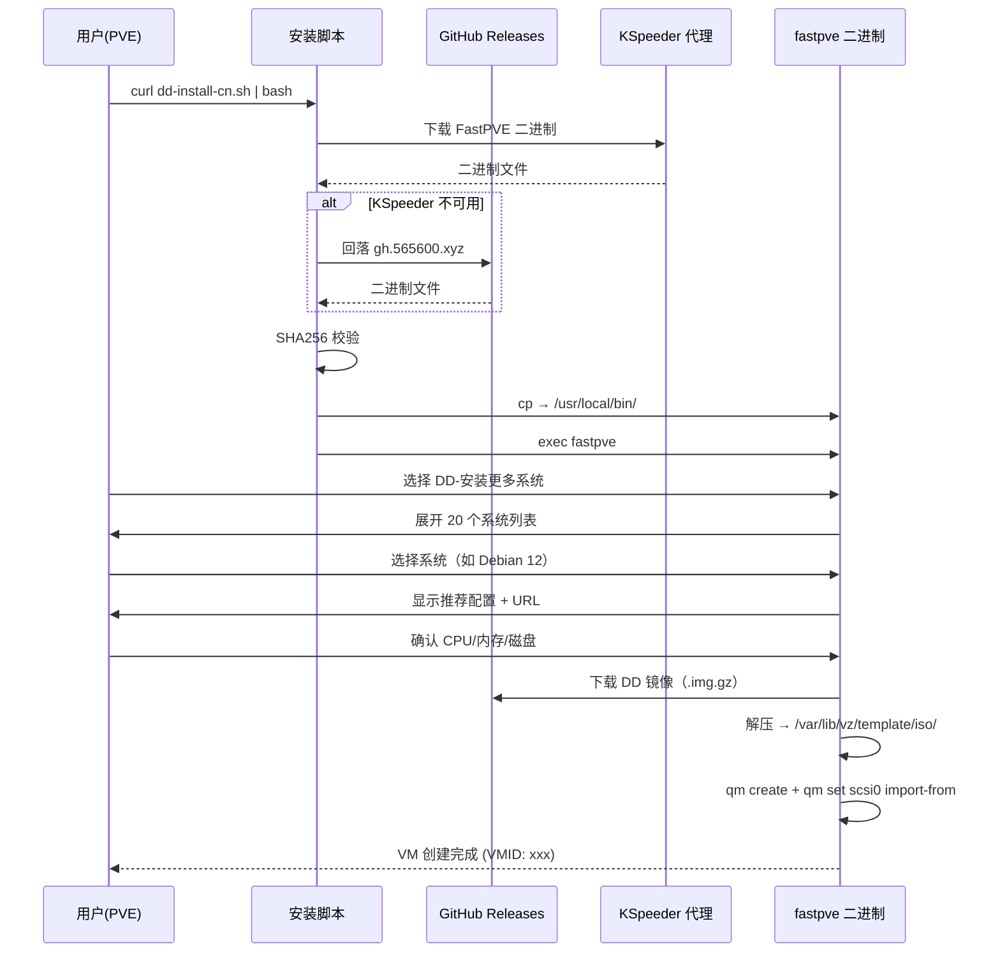

# FastPVE Plus — 架构图

## 整体架构



## DD 预设系统数据结构



## 代码分层

```
cmd/fastpve/
  prompt.go              ← 主菜单（0-6 + q）
  prompt_for_dd.go       ← 自定义 URL DD 安装（兜底）
  prompt_for_dd_presets.go  ← 预设系统展平菜单 + 安装流程
  prompt_for_win.go      ← Windows ISO 安装
  prompt_for_ubuntu.go   ← Ubuntu ISO 安装
  prompt_for_istoreos.go ← iStoreOS IMG 安装

cmd/download/
  main.go                ← fastpve-download CLI 入口
  dd.go                  ← dd 子命令

vmdownloader/
  dd.go                  ← DownloadDDImage + decompressDD
  presets.go             ← 20个系统预设定义
  istore.go              ← iStoreOS 下载逻辑
  windows.go             ← Windows ISO 下载
  ubuntu.go              ← Ubuntu ISO 下载
  vmdownloader.go        ← Downloader 接口 + DownloadFile

downloader/
  downloader.go          ← HTTP downloader
  resumable.go           ← 断点续传引擎

quickget/
  qm.go                  ← qm list / pvesm status 解析
```

## 安装流程时序


