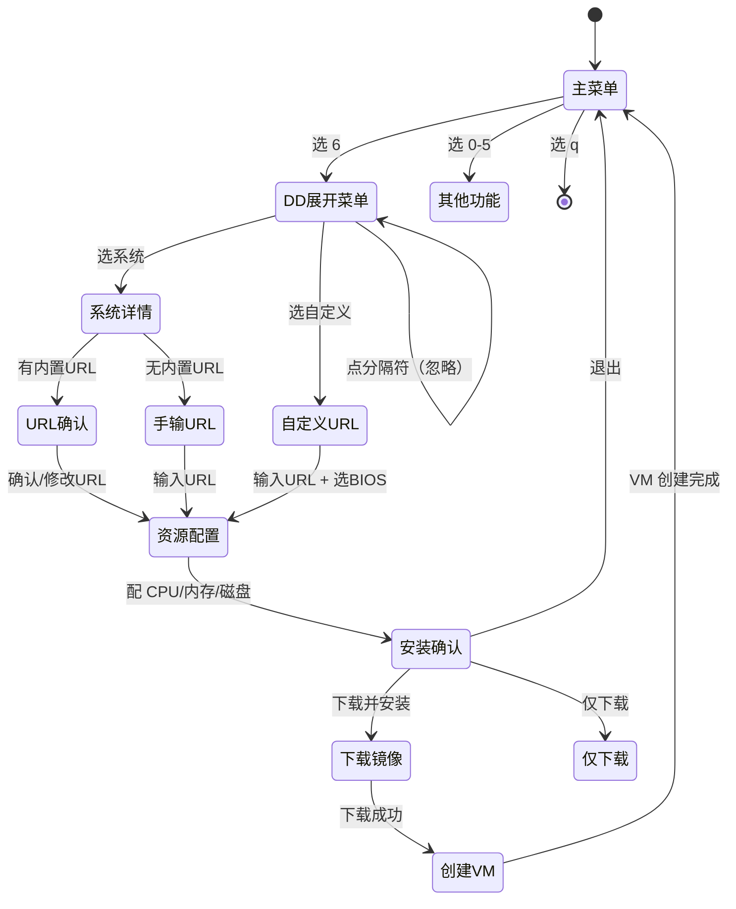
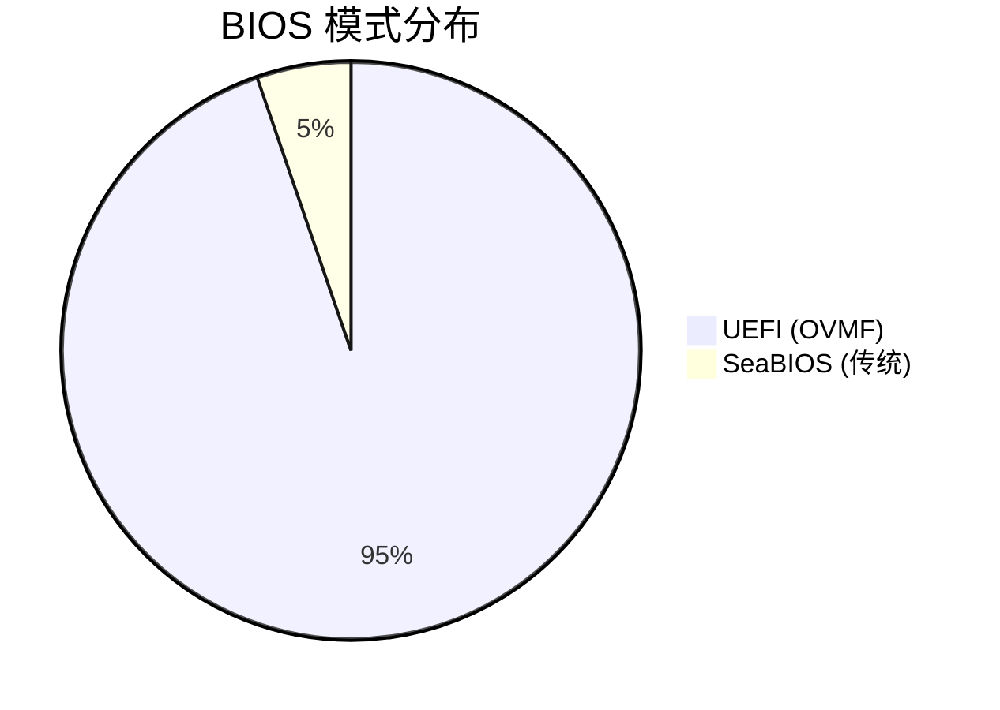

# FastPVE Plus — 菜单树

## ASCII 菜单结构

```
FastPVE Plus v0.1.9-dd1
================================

0、更换软件源          → 切换 apt 源（中科大/清华/华为）
1、安装Docker          → PVE 宿主机安装 Docker
2、安装iStoreOS        → 软路由（官方 IMG 导入）
3、安装Windows         → Win 11/10/7 ISO 安装
4、安装Ubuntu          → 22.04/24.10/25.04 ISO 安装
5、一键核显直通         → Intel iGPU 直通配置
6、DD-安装更多系统      ← [Plus] 20+ 系统 DD 镜像安装
q、退出

=== 选择 6 后展开 ===

── DD-软路由/防火墙 ──
    OpenWRT 官方              开源路由系统
    ImmortalWrt               OpenWRT 社区增强分支
    iStoreOS DD版              KoolCenter 软路由
    RouterOS CHR               MikroTik 路由系统
    pfSense CE                 FreeBSD 企业级防火墙
    OPNsense                   pfSense 分支，UI 更现代

── DD-NAS/存储 ──
    群晖 DSM (RR引导)          Redpill Recovery 引导
    TrueNAS Scale              开源企业级 NAS
    OpenMediaVault             Debian 系轻量 NAS
    飞牛私有云                 国产 NAS，照片管理出色

── DD-Windows ──
    Windows Server 2025        数据中心版
    Windows Server 2022        数据中心版
    Windows 11 LTSC            精简长期版
    Windows 10 LTSC            最稳定精简版

── DD-Linux服务器 ──
    Debian 12                  通用服务器
    Rocky Linux 9              RHEL 兼容
    Arch Linux                 滚动更新
    Alpine Linux               超轻量

── DD-其他 ──
    Home Assistant OS          智能家居中枢

    自定义URL（手动输入DD镜像地址）

================================
共计: 4 内置 + 1 Docker + 19 DD预设 + 1 自定义URL = 25 种选择
```

## 交互流程



## 预设系统 BIOS 分布



唯一使用 SeaBIOS 的系统：RouterOS CHR（MikroTik 要求传统 BIOS / MBR）。
